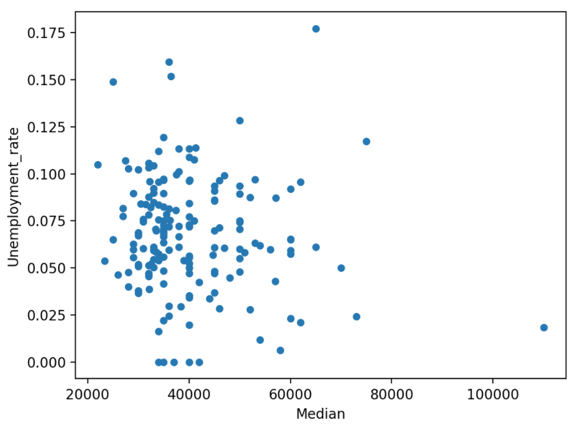

# Learning Pandas

> Do you have a large dataset that’s full of interesting insights, but you’re not sure where to start exploring it?
> Has your boss asked you to generate some statistics from it, but they’re not so easy to extract?
> These are precisely the use cases where Pandas and Python can help you! With these tools,
> you’ll be able to slice a large dataset down into manageable parts and glean insight from that information.

___

## Contents
- [First Steps](#First-Steps)
- [Displaying Data Types](#displaying-data-types)
- [Getting to Know Pandas’ Data Structures](#getting-to-know-pandas-data-structures)
- [Understanding DataFrame Objects](#understanding-dataframe-objects)
- [Accessing Series Elements](#accessing-series-elements)
- [Using .loc and .iloc](#using-loc-and-iloc)
- [Querying Your Dataset](#querying-your-dataset)
- [Grouping and Aggregating Your Data](#grouping-and-aggregating-your-data)
- [Manipulating Columns](#manipulating-columns)
- [Specifying Data Types](#specifying-data-types)
- [Cleaning Data](#cleaning-data)
- [Combining Multiple Datasets](#combining-multiple-datasets)
- [Visualizing Your Pandas DataFrame](#visualizing-your-pandas-dataframe)
- [Credits](#credits)

___

## [Pandas Cheat Sheet](pandas_cheat_sheet.pdf)


## First Steps

Upload the data.
```python
nba = pd.read_csv("../data/nba_all_elo.csv")
type(nba)
```

Some first information.
```python
len(nba)
nba.shape
```

Head of the data. The tail.
```python
nba.head()
nba.tail()
```

In order to show all the columns:
```python
pd.set_option("display.max.columns", None)
nba.head()
```

While it’s practical to see all the columns, you probably won’t need six decimal places! Change it to two:
```python
pd.set_option("display.precision", 2)
nba.head()
```

## Displaying Data Types
The first step in getting to know your data is
to discover the different data types it contains.
```python
nba.info()
```

### Showing Basics Statistics
```python
nba.describe()
# with a specific time:
nba.describe(include=object)
```

### Exploring Your Dataset
For example, you can examine how often specific values occur in a column:
```python
nba["team_id"].value_counts()
```

## Getting to Know Pandas’ Data Structures

While a DataFrame provides functions that can feel quite intuitive,
the underlying concepts are a bit trickier to understand.
For this reason, you’ll set aside the vast NBA DataFrame and
build some smaller Pandas objects from scratch.
```python
revenues = pd.Series([5555, 7000, 1980])
revenues
```

You’ve used the list [5555, 7000, 1980] to create a Series object called revenues. A Series object wraps two components:

- A sequence of values
- A sequence of identifiers, which is the index

You can access these components with `.values` and `.index`, respectively:
```python
revenues.values
#array([5555, 7000, 1980])
revenues.index
# RangeIndex(start=0, stop=3, step=1)
```

While Pandas builds on NumPy, a significant difference is in
their indexing. Just like a NumPy array,
a Pandas Series also has an integer index that’s implicitly defined.
This implicit index indicates the element’s position in the Series.

However, a Series can also have an arbitrary type of index.
You can think of this explicit index as labels for a specific row:

```python
city_revenues = pd.Series(
    [4200, 8000, 6500],
    index=["Amsterdam", "Toronto", "Tokyo"]
)
city_revenues
```

1. revenues: This Series behaves like a Python list because it only has a positional index.

1. city_revenues: This Series acts like a Python dictionary because it features both a positional and a label index.

```python
city_employee_count = pd.Series({"Amsterdam": 5, "Tokyo": 8})
city_employee_count
# Amsterdam    5
# Tokyo        8
# dtype: int64
city_employee_count.keys()
# Index(['Amsterdam', 'Tokyo'], dtype='object')
"Tokyo" in city_employee_count
# True
```

## Understanding DataFrame Objects
While a Series is a pretty powerful data structure, it has its limitations.
For example, you can only store one attribute per key.
As you’ve seen with the nba dataset, which features 23 columns,
the Pandas Python library has more to offer with its **DataFrame**.
This data structure is a sequence of Series objects that share the same index.

If you’ve followed along with the Series examples, then you should already have two Series objects with cities as keys:

1. city_revenues
1. city_employee_count

You can combine these objects into a DataFrame by providing a dictionary in the constructor.
The dictionary keys will become the column names, and the values should contain the Series objects:
```python
city_data = pd.DataFrame({
    "revenue": city_revenues,
    "employee_count": city_employee_count
})
city_data
           revenue  employee_count
Amsterdam     4200             5.0
Tokyo         6500             8.0
Toronto       8000             NaN
```

You can also refer to the 2 dimensions of a DataFrame as axes:
```python

city_data.axes
[Index(['Amsterdam', 'Tokyo', 'Toronto'], dtype='object'),
 Index(['revenue', 'employee_count'], dtype='object')]
city_data.axes[0]
 Index(['Amsterdam', 'Tokyo', 'Toronto'], dtype='object')
city_data.axes[1]
Index(['revenue', 'employee_count'], dtype='object')
```

A DataFrame is also a dictionary-like data structure, so it also supports .keys() and the in keyword.
However, for a DataFrame these don’t relate to the index, but to the columns:
```python
>>> city_data.keys()
Index(['revenue', 'employee_count'], dtype='object')
>>> "Amsterdam" in city_data
False
>>> "revenue" in city_data
True
```

## Accessing Series Elements

Recall that a Series has two indices:

1. A positional or implicit index, which is always a RangeIndex
1. A label or explicit index, which can contain any hashable objects

You can conveniently access the values in a Series with both the label and positional indices:
```python
>>> city_revenues["Toronto"]
8000
>>> city_revenues[1]
8000
```


## Using .loc and .iloc
The indexing operator (`[]`) is convenient, but there’s a caveat. What if the labels are also numbers?
Say you have to work with a Series object like this:
```python
>>> colors = pd.Series(
...     ["red", "purple", "blue", "green", "yellow"],
...     index=[1, 2, 3, 5, 8]
... )
>>> colors
1       red
2    purple
3      blue
5     green
8    yellow
dtype: object
```
What will colors[1] return? For a positional index, colors[1] is "purple".
However, if you go by the label index, then colors[1] is referring to "red".

The good news is, you don’t have to figure it out!
Instead, to avoid confusion, the Pandas Python library provides two data access methods:

1. `.loc` refers to the label index.
1. `.iloc` refers to the positional index.
These data access methods are much more readable:
```python
>>> colors.loc[1]
'red'
>>> colors.iloc[1]
'purple'
```
<p align="center">
    
</p>

## Querying Your Dataset
You’ve seen how to access subsets of a huge dataset based on its indices.
Now, you’ll select rows based on the values in your dataset’s columns to query your data.
```python
>>> current_decade = nba[nba["year_id"] > 2010]
>>> current_decade.shape
(12658, 24)
>>> games_with_notes = nba[nba["notes"].notnull()]  # or .notna()
>>> games_with_notes.shape
(5424, 24)
>>> ers = nba[nba["fran_id"].str.endswith("ers")]
>>> ers.shape
(27797, 24)
>>> nba[
...     (nba["_iscopy"] == 0) &
...     (nba["pts"] > 100) &
...     (nba["opp_pts"] > 100) &
...     (nba["team_id"] == "BLB")
... ]
```

## Grouping and Aggregating Your Data
You may also want to learn other features of your dataset, like the sum, mean, or average value of a group of elements.
Luckily, the Pandas Python library offers grouping and aggregation functions to help you accomplish this task.
```python
>>> city_revenues.sum()
18700
>>> city_revenues.max()  # There are other methods you can use, like .min() and .mean().
8000
>>> nba.groupby("fran_id", sort=False)["pts"].sum()
fran_id
Huskies           3995
Knicks          582497
Stags            20398
Falcons           3797
Capitols         22387
...
>>> nba[
...     (nba["fran_id"] == "Spurs") &
...     (nba["year_id"] > 2010)
... ].groupby(["year_id", "game_result"])["game_id"].count()
year_id  game_result
2011     L              25
         W              63
2012     L              20
         W              60
2013     L              30
         W              73
2014     L              27
         W              78
2015     L              31
         W              58
Name: game_id, dtype: int64
```
> Remember, a column of a DataFrame is actually a Series object.
> For this reason, you can use these same functions on the columns of nba:
```python
>>> points = nba["pts"]
>>> type(points)
<class 'pandas.core.series.Series'>
>>> points.sum()
12976235
```

## Manipulating Columns

Create a copy of your original DataFrame to work with:
```python
>>> df = nba.copy()
>>> df.shape
(126314, 24)
```
You can define new columns based on the existing ones:
```python
>>> df["difference"] = df.pts - df.opp_pts
>>> df.shape
(126314, 25)
>>> df["difference"].max()
68
```

You can also rename the columns of your dataset. It seems that "game_result" and "game_location" are too verbose,
so go ahead and rename them now:
```python
>>> renamed_df = df.rename(
...     columns={"game_result": "result", "game_location": "location"}
... )
>>> renamed_df.info()
<class 'pandas.core.frame.DataFrame'>
RangeIndex: 126314 entries, 0 to 126313
Data columns (total 25 columns):
 #   Column       Non-Null Count   Dtype
---  ------       --------------   -----
 0   gameorder    126314 non-null  int64
 ...
 19  location     126314 non-null  object
 20  result       126314 non-null  object
 21  forecast     126314 non-null  float64
 22  notes        5424 non-null    object
 23  date_played  126314 non-null  datetime64[ns]
 24  difference   126314 non-null  int64
dtypes: datetime64[ns](1), float64(6), int64(8), object(10)
memory usage: 24.1+ MB
```

## Specifying Data Types

You would probably not use a varchar type, but rather an enum.
Pandas provides the categorical data type for the same purpose:
```python
>>> df["game_location"] = pd.Categorical(df["game_location"])
>>> df["game_location"].dtype
CategoricalDtype(categories=['A', 'H', 'N'], ordered=False)
```
**categorical data** has a few advantages over unstructured text.
When you specify the categorical data type, you make validation easier and save a ton of memory,
as Pandas will only use the unique values internally.
The higher the ratio of total values to unique values, the more space savings you’ll get.

## Cleaning Data

Sometimes, the easiest way to deal with records containing missing values is to ignore them.
You can remove all the rows with missing values using `.dropna()`:
```python
>>> rows_without_missing_data = nba.dropna()
>>> rows_without_missing_data.shape
(5424, 24)
```

You can also drop problematic columns if they’re not relevant for your analysis.
To do this, use `.dropna()` again and provide the axis=1 parameter:
```python
>>> data_without_missing_columns = nba.dropna(axis=1)
>>> data_without_missing_columns.shape
(126314, 23)
```

If there’s a meaningful default value for your use case, then you can also replace the missing values with that:
```python
>>> data_with_default_notes = nba.copy()
>>> data_with_default_notes["notes"].fillna(
...     value="no notes at all",
...     inplace=True
... )
>>> data_with_default_notes["notes"].describe()
count              126314
unique                232
top       no notes at all
...
```

## Combining Multiple Datasets

```python
>>> further_city_data = pd.DataFrame(
...     {"revenue": [7000, 3400], "employee_count":[2, 2]},
...     index=["New York", "Barcelona"]
... )
>>> all_city_data = pd.concat([city_data, further_city_data], sort=False)
>>> all_city_data
Amsterdam   4200    5.0
Tokyo       6500    8.0
Toronto     8000    NaN
New York    7000    2.0
Barcelona   3400    2.0
```
By default, `concat()` combines along `axis=0`. In other words, it appends rows.
You can also use it to append columns by supplying the parameter `axis=1`:
```python
>>> city_countries = pd.DataFrame({
...     "country": ["Holland", "Japan", "Holland", "Canada", "Spain"],
...     "capital": [1, 1, 0, 0, 0]},
...     index=["Amsterdam", "Tokyo", "Rotterdam", "Toronto", "Barcelona"]
... )
>>> cities = pd.concat([all_city_data, city_countries], axis=1, sort=False)
>>> cities
           revenue  employee_count  country  capital
Amsterdam   4200.0             5.0  Holland      1.0
Tokyo       6500.0             8.0    Japan      1.0
Toronto     8000.0             NaN   Canada      0.0
New York    7000.0             2.0      NaN      NaN
Barcelona   3400.0             2.0    Spain      0.0
Rotterdam      NaN             NaN  Holland      0.0
>>> pd.concat([all_city_data, city_countries], axis=1, join="inner")
           revenue  employee_count  country  capital
Amsterdam     4200             5.0  Holland        1
Tokyo         6500             8.0    Japan        1
Toronto       8000             NaN   Canada        0
Barcelona     3400             2.0    Spain        0
```

## Visualizing Your Pandas DataFrame

In Jupiter Notebook make:
```python
>>> %matplotlib inline
```

Both Series and DataFrame objects have a `.plot()` method, which is a wrapper around `matplotlib.pyplot.plot()`.
By default, it creates a line plot. Visualize how many points the Knicks scored throughout the seasons:
```python
>>> nba[nba["fran_id"] == "Knicks"].groupby("year_id")["pts"].sum().plot()
>>> nba["fran_id"].value_counts().head(10).plot(kind="bar")
In [8]: df.plot(x="Rank", y=["P25th", "Median", "P75th"])
Out[8]: <AxesSubplot:xlabel='Rank'>
```
<p align="center">
    
</p>

```python
In [14]: median_column.plot(kind="hist")
Out[14]: <AxesSubplot:ylabel='Frequency'>
```
<p align="center">
    
</p>

```python
In [19]: df.plot(x="Median", y="Unemployment_rate", kind="scatter")
Out[19]: <AxesSubplot:xlabel='Median', ylabel='Unemployment_rate'>
```
<p align="center">
    
</p>

```python
In [23]: small_cat_totals = cat_totals[cat_totals < 100_000]
In [24]: big_cat_totals = cat_totals[cat_totals > 100_000]
In [25]: # Adding a new item "Other" with the sum of the small categories
In [26]: small_sums = pd.Series([small_cat_totals.sum()], index=["Other"])
In [27]: big_cat_totals = big_cat_totals.append(small_sums)
In [28]: big_cat_totals.plot(kind="pie", label="")
Out[28]: <AxesSubplot:>
```
<p align="center">
    
</p>

<!-- ```python -->
<!-- ``` -->

## [Some Pandas Examples](scripts/examples.ipynb)

___

## Credits:

- [Pandas Python Explore Dataset - Real Python](https://realpython.com/pandas-python-explore-dataset)
- [Pandas Python Visualization - Real Python](https://realpython.com/pandas-plot-python/)
- [Pandas - Docs](https://pandas.pydata.org/docs/reference/index.html)